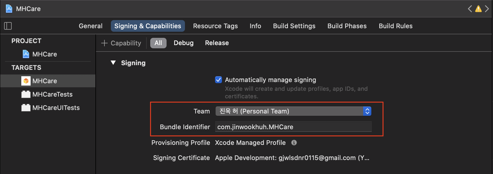
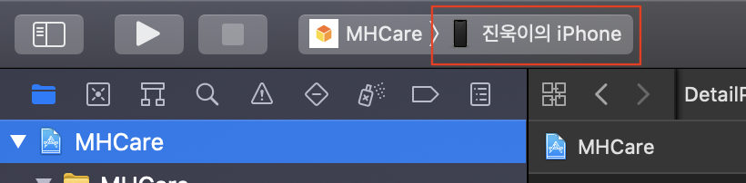

# Caramel: Mental Health Assistant

> 1st Runner-up in 2021 KPMG Ideathon, South Korea

<div>
    <p align = "center">
	
    </p>
</div>

* [Introduction](https://github.com/diffunity/kpmg-corona-blue#Introduction)

* [Overview](https://github.com/diffunity/kpmg-corona-blue#Overview)
  * Overall display
* [Frontend](https://github.com/diffunity/kpmg-corona-blue#Frontend)

  * Main tab
  * Text tab
  * Voice tab
  * Visual tab

* [Backend](https://github.com/diffunity/kpmg-corona-blue#Backend)

* [Branch Structure](https://github.com/diffunity/kpmg-corona-blue#Branch-Structure)

# Introduction

The protracted COVID-19 social-distancing situation is emotionally exhausting people. Our normal pre-COVID day-to-day social interactions are slowly fading into the past. We are thus seeking ways to fulfil our unmet social desires. It is easy to overlook the gradual collapse of our emotions in such an era, and we are in dire need of a service that allows us to effortlessly track our emotions.

Caramel is an application that lets you know your mental status. It can analyze your emotions in your phone call, SNS texts and picture, etc. Emotions contained in various forms of data (videos, pictures, texts, audio) are, in fact, subjective. Therefore, we attempted to provide as many statistics of our analysis as possible. We hope that this contributes to the development of mental healthcare services so as to aid in the understanding of our own emotional status.

# Overview 

- Overall display

<div>
    
    
    
    
</div>


# Frontend

## Requirements
- Swift 5
- Xcode
- Cocoapods

## Run project
### Installation
- Install CocoaPods
  ```
  $ sudo gem install cocoapods
  ```
- Navigate to the directory where file MHCare.xcworkspace is located and enter command
  ```
  pod install
  ```

### Build and Run
- Open file **MHCare.xcworkspace**
- Go to Signing & Capabilities tab and set your own Team / Bundle Identifier
  

- Set the device to a physical iOS device (Some functions might not work when running on a simulator)
  
- Run!!

## Functions

- Main tab

  - Update analyzed data with an update button
  - Display total happiness score as 'Caramel Score'
  - Redirect user to each tab, which provide score about specific sense

- Text tab

  - Provide user's emotions in SNS posts

- Voice tab

  - Provide user's emotions in phone call
  - Divided into two sections: Tone & Content
    - Tone: Analyze user's tone and pitch, accents and determine user's emotion only with them. Do not use contents of conversation at all
    - Content: Analyze user's conversational contents during the phone call. Use Google STT API to make speech data to text

- Visual tab

  - Analyze user's photos and videos with vision model
  - Automatically detect face in the photo
    - In case of face exists in photo, the model use facial expression recognition model
    - In case of face do not exists in photo, the model user sentimental image detection model
  - Divided into two sections: Photo & Video

  
# Backend

<div>
	
	
</div>
Details on the models are provided in the respective folders  

## Detached API service

We believe that the future potentials of multimodal emotion recognition tasks are boundless. As such, we have developed completely detached APIs for each tasks (audio, vision, nlp) in docker containers with scheduling maintained by AWS SQS, and deployed them using AWS ECS.  We also automated deployment process using AWS CodeBuild. The API demo for the tasks can be found in the google colab links below.

* API: text/image
https://colab.research.google.com/drive/1D-E6IOy1LieElvAn9c8tRVfKdJxIs_un?usp=sharing
* API: audio
https://colab.research.google.com/drive/1zQURDnBu91oc0USzRfNQvEx3jVxVe_QS?usp=sharing

**Note**: Due to the maintenance costs, we have disabled the APIs for now. If you wish to use them, please contact us by spacefor555@gmail.com


# Branch Structure 

* Branch structure

```shell
├── main (empty)
└── dev
    ├── model
    │   ├── nlp
    │   ├── vision
    │   └── audio
    ├── backend
    └── frontend
```
